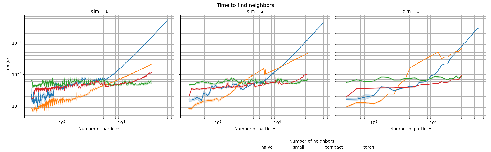
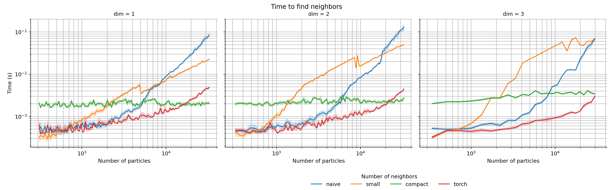
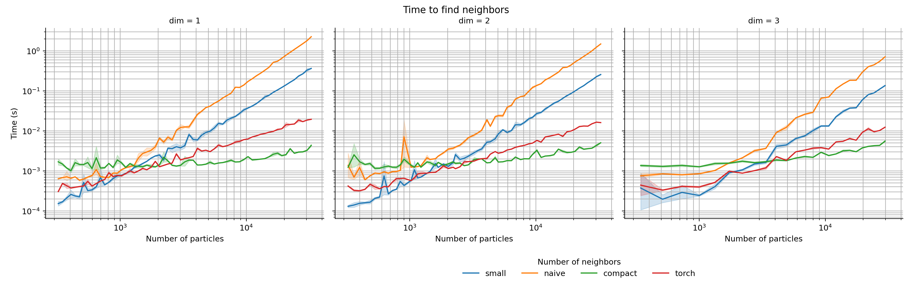
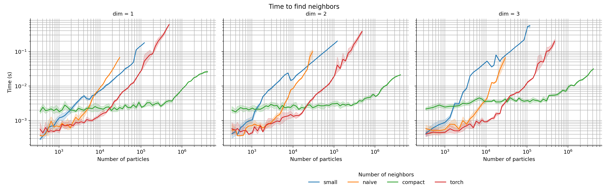

# pyTorch Compact Radius

This repository contains an implementation of a compact hashing based neighborhood search for 1D, 2D and 3D data for pyTorch using a C++/CUDA backend. 

## Usage

The main usage of this code is similar to the radius search in torch_cluster's radius:

## Performance

Compute Performance on GPUs for small scale problems:

3090 | A5000
---|---
 | 

CPU perforamnce:

Overall GPU based performance for larger scale problems:

